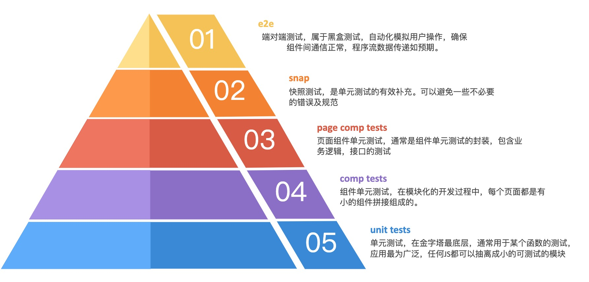
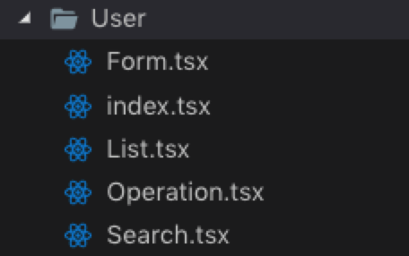
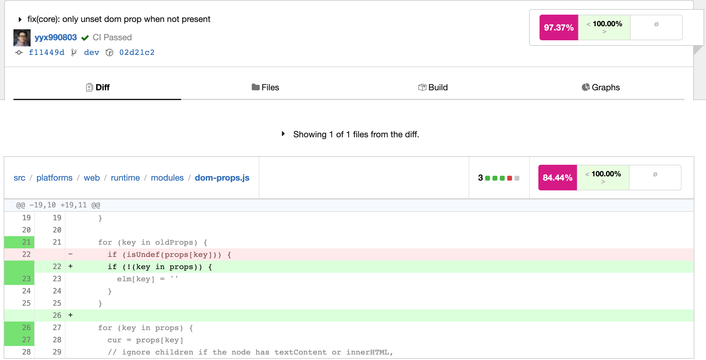
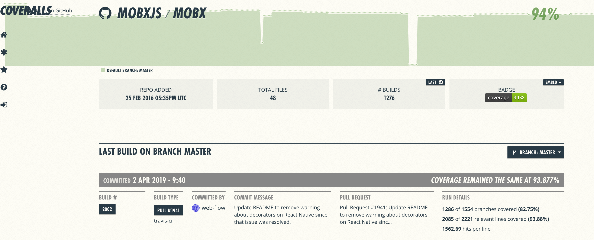

:::tip
单元测试分享
本分享的核心不是如何写单元测试，更想分享的是一种思路，让我们在写函数、组件、页面的时候，用可测试性的思路进行编码
:::

<!-- more -->

## 前言

长期以来，前端开发的单元测试并不是在前端的开发过程中所必须的，也不是每个前端开发工程师所注意和重视的，<br />
甚至扩大到软件开发过程中单元测试这一环也不是在章程上有书面规定所要求的。曾经的我也问过许多次自己以及身边的前端工程师。<br />
为什么前端要写单元测试？前端的单元测试和测试工程师的测试有什么区别？在开发过程中，花费大量时间的时间去写单元测试值不值得？

### 为什么要进行测试？？

1. 测试可以确保得到预期的结果
2. 作为现有代码行为的描述
3. 促使开发者写可测试的代码，一般可测试的代码可读性也会高一点
4. 如果依赖的组件有修改，受影响的组件能在测试中发现错误
5. 对开源帮助巨大

### 测试类型

- 单元测试：指的是以原件的单元为单位，对软件进行测试。单元可以是一个函数，也可以是一个模块或一个组件，基本特征就是只要输入不变，必定返回同样的输出。一个软件越容易写单元测试，就表明它的模块化结构越好，给模块之间的耦合越弱。React 的组件化和函数式编程，天生适合进行单元测试
- 功能测试：相当于是黑盒测试，测试者不了解程序的内部情况，不需要具备编程语言的专门知识，只知道程序的输入、输出和功能，从用户的角度针对软件界面、功能和外部结构进行测试，不考虑内部的逻辑
- 集成测试：在单元测试的基础上，将所有模块按照设计要求组装成子系统或者系统，进行测试
- 冒烟测试：在正式全面的测试之前，对主要功能进行的测试，确认主要功能是否满足需要，软件是否能正常运行

### 开发模式

- TDD: 测试驱动开发，英文为 Testing Driven Development，强调的是一种开发方式，以测试来驱动整个项目，即先根据接口完成测试编写，然后在完成功能是要不断通过测试，最终目的是通过所有测试
- BDD: 行为驱动开发，英文为 Behavior Driven Development，BDD 的核心价值是体现在正确的对系统行为进行设计，所以它并非一种行之有效的测试方法。它强调的是系统最终的实现与用户期望的行为是一致的、验证代码实现是否符合设计目标。但是它本身并不强调对系统功能、性能以及边界值等的健全性做保证，无法像完整的测试一样发现系统的各种问题。但 BDD 倡导的用简洁的自然语言描述系统行为的理念，可以明确的根据设计产生测试，并保障测试用例的质量。
- DDD: Domain-drive Design,领域驱动设计。其目的是以一种领域专家、设计人员、开发人员都能理解的通用语言作为相互交流的工具，在交流的过程中发现领域概念，然后将这些概念设计成一个领域模型，再有该模型驱动软件设计和开发。

TDD 和 BDD 有各自的使用场景，BDD 一般偏向于系统功能和业务逻辑的自动化测试设计；而 TDD 在快速开发并测试功能模块的过程中则更加高效，以快速完成开发为目的。DDD 则较为复杂

## 单元测试工具

说起单元测试，市面上的单元测试工具形形色色，五花八门。最常使用的工具为:Jest Mocha Jasmine

- 🛠 工具[Jest](https://www.npmjs.com/package/eslint)
  安装

  ```bash
  yarn add jest //项目安装
  yarn add jest -g //全局安装
  ```

  - facebook 坐庄
  - 基于 Jasmine 至今已经做了大量修改添加了很多特性
  - 开箱即用配置少，API 简单
  - 支持断言和仿真
  - 支持快照测试
  - 在隔离环境下测试
  - 互动模式选择要测试的模块
  - 优雅的测试覆盖率报告，基于 Istanbul
  - 全局环境，比如 describe 不需要引入直接用

- 🛠 工具[Mocha](https://mochajs.org/)
  安装

  ```bash
  yarn add mocha
  ```

  - 灵活(不包括断言和仿真，自己选对应工具)
  - 流行的选择：chai，sinon
  - 社区成熟用的人多，测试各种东西社区都有示例
  - 需要较多配置
  - 可以使用快照测试，但依然需要额外配置

个人推荐使用 jest 进行单元测试。理由如下：

- jest 与 babel 对 es6 的转码集成良好。
- jest 的 api 文档完整且 api 设计良好。
- jest 对异步代码测试内置支持完善。
- jest 内置完善的 mock 与 stub 工具。
- jest 运行如飞。
- jest 可自调用 istanbul，无痛生成覆盖率统计文档。
- jest 使用约定大于配置的原则，需配置项较少，且同时兼顾定制需求。
- 使用 jsdom，在 nodejs 环境可模拟浏览器环境，与 jest 集成后测试前端的浏览器环境代码。
- jest 文档丰富且有广泛的开发者基础。

[Jest 常用 API](https://jestjs.io/docs/en/api.html)

- describe(name, fn)：描述块，讲一组功能相关的测试用例组合在一起
- it(name, fn, timeout)：别名 test，用来放测试用例
- afterAll(fn, timeout)：所有测试用例跑完以后执行的方法
- beforeAll(fn, timeout)：所有测试用例执行之前执行的方法
- afterEach(fn)：在每个测试用例执行完后执行的方法
- beforeEach(fn)：在每个测试用例执行之前需要执行的方法

[Enzyme](https://enzymejs.github.io/enzyme/)

Enzyme 是 Airbnb 开源的 React 测试工具库库，它功能过对官方的测试工具库 ReactTestUtils 的二次封装，提供了一套简洁强大的 API。
实现了 jQuery 风格的方式进行 DOM 处理，开发体验十分友好。在开源社区有超高人气，同时也获得了 React 官方的推荐。

[Vue Test Utils](https://vue-test-utils.vuejs.org/zh/)

Vue Test Utils 是 Vue.js 官方的单元测试实用工具库

**测试的渐进性：**



**最终为了各种场景下 React 的单元测试，集成了下面的 lib：**

- Jest：单元测试框架
- enzyme： React 测试库
- enzyme-adapter-react-16： enzyme 和 React 的配套库 用于保证 enzyme 渲染的版本和你使用的 React 版本是一致的。
- fetch-mock： 异步请求模拟
- babel-7-jest:Jest 对应的 babel
- eslint-plugin-jest：jest 对应的 eslint
- jsdom：虚拟 dom 环境

**最终为了各种场景下 Vue 的单元测试，集成了下面的 lib：**

- Jest：单元测试框架
- fetch-mock： 异步请求模拟
- Vue Test Utils：Vue.js 官方的单元测试实用工具库
- babel-7-jest:Jest 对应的 babel
- eslint-plugin-jest：jest 对应的 eslint
- jsdom：虚拟 dom 环境

---

**下面主要介绍 React 的单元测试流程**

## 函数式单元测试

### 测试前须知

1. 使用 Jest 进行单元测试尽量保证是纯函数。即函数有入参并以 return 结尾。
2. 函数尽量不要依赖外部变量。
3. react 函数（返回值为 JSX）不属于该测试范围
4. jest 配置：在根目录下创建 jest.config.js。

### 测试步骤

1. 写一个纯函数

```javascript
/**
 * @category String
 * @description 去除全部空格
 * @author xufeng
 * @date 2020-07-10
 * @export
 * @param {string} string
 * @returns {string}
 */
export function trimAll(string: string): string {
  return (string || '').replace(/[\s\uFEFF]+|[\s\uFEFF]+/g, '');
}
```

2. 在**test**文件夹下建一个文件 fn.test.js

3. 进行单元测试

```javascript
import { trimAll } from '@/string';

describe('string', function() {
  describe('trim', function() {
    it('前面有空格', function() {
      expect(trimAll(' 123')).toBe('123');
    });
    it('中间有空格', function() {
      expect(trimAll('12 3')).toBe('123');
    });
    it('后面有空格', function() {
      expect(trimAll('123 ')).toBe('123');
    });
    it('都是空格', function() {
      expect(trimAll(' 1 2 3 ')).toBe('123');
    });
    it('传空', function() {
      expect(trimAll('')).toBe('');
    });
  });
});
```

## 组件单元测试

### enzyme3 种渲染方式介绍

**三种渲染方法**

- shallow：浅渲染，是对官方的 Shallow Renderer 的封装。将组件渲染成虚拟 DOM 对象，只会渲染第一层，子组件将不会被渲染出来，使得效率非常高。不需要 DOM 环境， 并可以使用 jQuery 的方式访问组件的信息
- render：静态渲染，它将 React 组件渲染成静态的 HTML 字符串，然后使用 Cheerio 这个库解析这段字符串，并返回一个 Cheerio 的实例对象，可以用来分析组件的 html 结构
- mount：完全渲染，它将组件渲染加载成一个真实的 DOM 节点，用来测试 DOM API 的交互和组件的生命周期。用到了 jsdom 来模拟浏览器环境

### 测试前须知

1. 使用 Jest 进行组件测试需要模拟浏览器环境，目前与 react 配合较好的是 enzyme 及 jsdom。
2. 一个测试用例只做一件事，所以尽可能将组件拆分为最小单元。
3. 模拟数据及接口使用 fetch-mock
4. 在测试之前执行 steup 函数将所有环境模拟好，在测试中直接使用即可

### 测试组件内容

1. Props 传入；
2. 组件分支渲染逻辑；
3. 事件调用和参数传递。

### 测试步骤

就拿一个简单的权限高阶组件做例子：

```javascript
import React from 'react';
import { Provider } from 'mobx-react';
import { mount } from 'enzyme';
import Permission from 'component/Permission';
import permissionStore from 'store/permission';

const TestPermission = () => (
  <Provider store={{ permissionStore }}>
    <Permission resource="ok">
      <span>hasPermission</span>
    </Permission>
  </Provider>
);

describe('component/Permission', () => {
  it('测试无权限', () => {
    const app = mount(<TestPermission />);
    expect(permissionStore.has('ok')).toBe(false);
    expect(app.text()).toBe(null);
  });

  it('测试有权限', () => {
    permissionStore.data.add('ok');
    const app = mount(<TestPermission />);
    expect(permissionStore.has('ok')).toBe(true);
    expect(app.text()).toBe('hasPermission');
  });
});
```

## 页面级别单元测试

通常页面级别的单元测试是不需要前端来做的。页面通常被分割成多个公用的组件及 Store（MVVM 下），数据与表现分离，即数据层和通用组件层我们已经通过上述 2 种方式进行过相应的单元测试了。页面级别的测试通常只针对简单的文案及 CSS 进行测试就够了。

例如我们可以对一个页面的跟组件进行测试：

```javascript
import React from 'react';
import { shallow } from 'enzyme';
import { Card } from 'antd';
import A from 'page/A';
import Operation from 'page/A/Operation';
import List from 'page/A/List';
import Search from 'page/A/Search';
import CardTitle from 'component/CardTitle';

describe('page/A', () => {
  it('测试页面可完整渲染', () => {
    const app = shallow(<A />);
    expect(app.find(Card)).toHaveLength(1);
    expect(app.contains(<Operation />)).toBeTruthy();
    expect(app.contains(<List />)).toBeTruthy();

    // 测试可完整渲染Card title属性
    const title = app.find(Card).prop('title');
    expect(title.type).toEqual(CardTitle);
    expect(title.props.children.type).toEqual(Search);

    const app2 = shallow(<A showOperation={false} />);
    expect(app2.contains(<Operation />)).toBeFalsy();
  });
});
```

**如何让一个页面可测试（方便测试）？？？**

如下图所示，讲页面组件拆分成最小单元，保证每个小的组件都是可插拔的。



```javascript
import React from 'react';
import { Card } from 'antd';
import Form from './Form';
import Search from './Search';
import Operation from './Operation';
import List from './List';

const User = () => (
  <Card bordered={false} title={<Search />}>
    <Operation />
    <List />
    <Form />
  </Card>
);
export default User;
```

## 快照测试

> 每当你想要确保你的用户界面不会有意外的改变，快照测试是非常有用的工具。—— Jest Doc

本例中使用 Jest 的快照测试进行测试

例我们有一个 Button 组件

```javascript
import React, { Component } from 'react';

export default class LinkButton extends Component {
  constructor() {
    super();
    this.state = { liked: false };
  }

  handleClick = () => {
    return this.setState({
      liked: !this.state.liked,
    });
  };

  render() {
    const text = this.state.liked ? 'like' : "haven't liked";
    return <p onClick={this.handleClick}>You {text} this.Click to toggle.</p>;
  }
}
```

上面的组件拥有三种状态，初始状态，点击状态，以及再次被点击的状态。依此我们生成三种状态的快照。

```javascript
import React from 'react';
import renderer from 'react-test-renderer';
import LinkButton from '../LinkButton';
describe('<LinkButton/>', () => {
  it('Snapshot', () => {
    const component = renderer.create(<LinkButton />);

    let snapshot = component.toJSON();
    expect(snapshot).toMatchSnapshot();

    snapshot.props.onClick();
    snapshot = component.toJSON();
    expect(snapshot).toMatchSnapshot();

    snapshot.props.onClick();
    snapshot = component.toJSON();
    expect(snapshot).toMatchSnapshot();
  });
});
```

运行

```
npm test
```

之后会生成

```
exports[`<LinkButton/> Snapshot 1`] = `
<p
  onClick={[Function bound handleClick]}>
  You
  haven\'t liked
   this.Click to toggle.
</p>
`;

exports[`<LinkButton/> Snapshot 2`] = `
<p
  onClick={[Function bound handleClick]}>
  You
  like
   this.Click to toggle.
</p>
`;

exports[`<LinkButton/> Snapshot 3`] = `
<p
  onClick={[Function bound handleClick]}>
  You
  haven\'t liked
   this.Click to toggle.
</p>
`;
```

此时如果修改 Button 组件内容，再次运行测试之后，控制台会显示测试未通过，并将两次快照不匹配的位置标记出来。这样可以防止无意间修改组件的某些部分

如果需要修改快照，运行

```
npm run test -- -u
```

## E2E 单元测试

问题？？如何确定用户可以顺利走完一个购买流程呢?

1. 打开网页
2. 浏览商品
3. 加入购物车
4. 下单确认
5. 付款

单纯依靠人力来测试完整功能非常耗时耗力, 这时候自动化测试就体现价值了

自动化测试是把人的测试行为转化为机器执行的程序, 可以提高效率, 解放生产力, 节省人力成本和时间成本, 降低人类易出错的风险

现代比较流行的 e2e 测试框架有

- Nightwatch
- TestCafe
- Protractor
- WebdriverIO
- katalon
- Cypress
- Jest puppeteer

|     名称      |         断言          | 跨浏览器 |          实现          |                      官网                      | 是否开源 |
| :-----------: | :-------------------: | :------: | :--------------------: | :--------------------------------------------: | :------: |
|  nightwatch   | assert 和 Chai Expect |    是    |        selenium        |            http://nightwatchjs.org/            |    是    |
|    cypress    | Chai、Chai-jQuery 等  |    否    |         Chrome         |            https://www.cypress.io/             |    是    |
|   testcafe    |     自定义的断言      |    是    | 不是基于 selenium 实现 |     https://devexpress.github.io/testcafe/     |    是    |
|    katalon    |        TDD/BDD        |    是    |           -            |    https://www.katalon.com/katalon-studio/     |    否    |
|  Protractor   | assert 和 Chai Expect |    是    |        selenium        |     https://github.com/angular/protractor      |    否    |
|  WebdriverIO  | assert 和 Chai Expect |    是    |        selenium        |             https://webdriver.io/              |    否    |
| jest-puppteer |       jest 断言       |    是    |         Chrome         | https://github.com/smooth-code/jest-puppeteer/ |    是    |

### 测试前须知

1. 通常 E2E 测试是我们正常开发已经完成，最好有完整的测试环境（开发、生产）。
2. E2E 测试需要我们对整个业务逻辑非常熟练，即多页面之间的交互甚至整个项目流程。

下面介绍 2 种 E2E 测试工具 Nightwatch 及 Jest puppeteer

**Nightwatch**

```javascript
module.exports = {
  'test notFound page': (browser) => {
    browser
      .url('http://localhost:8080/xxxx')
      .maximizeWindow()
      .useXpath()
      .assert.containsText('//*[@id="app"]/div[3]/div[2]/h1', '404')
      .assert.containsText(
        '//*[@id="app"]/div[3]/div[2]/h2',
        '抱歉，您访问的页面不存在'
      )
      .pause(1000)
      .assert.urlContains('http://localhost:8080/xxxx')
      .click('//*[@id="app"]/div[3]/div[2]/div/button')
      .pause(1000)
      .assert.urlContains('http://localhost:8080/Home')
      .end();
  },
};
```

**Jest puppeteer**

```javascript
const pageUrl = `${protocal}://${host}:${port}`;
describe('goto page', () => {
  beforeAll(async () => {
    page = await browser.newPage();
    await page.setViewport({
      width: 1920,
      height: 1080,
    });
  });

  it('go to user page', async () => {
    await page.goto(`${pageUrl}/user`);
    await page.waitForSelector('label[for="account"]');
    await page.waitForSelector('label[for="name"]');
    await page.waitForSelector('label[for="mail"]');
    await page.waitForSelector('label[for="mobile"]');
  });

  it('coverage', async () => {
    await Promise.all([
      page.coverage.startJSCoverage(),
      page.coverage.startCSSCoverage(),
    ]);
    await page.goto(pageUrl);
    await page.hover('.ant-menu-root');
    await page.click('.ant-menu-item a[href="/user"]');
    // await jestPuppeteer.debug()
    const [jsCoverage, cssCoverage] = await Promise.all([
      page.coverage.stopJSCoverage(),
      page.coverage.stopCSSCoverage(),
    ]);
    const coverage = [...jsCoverage, ...cssCoverage];
    let totalBytes = 0;
    let usedBytes = 0;
    coverage.forEach((entry) => {
      totalBytes += entry.text.length;
      entry.ranges.forEach((range) => {
        usedBytes += range.end - range.start - 1;
      });
    });
    log(`Bytes used: ${(usedBytes / totalBytes) * 100}%`);
  });
});
```

## 覆盖率

单元测试覆盖率是一种软件测试的度量指标，指在所有功能代码中，完成了单元测试的代码所占的比例。有很多自动化测试框架工具可以提供这一统计数据，其中最基础的计算方式为：

> 单元测试覆盖率 = 被测代码行数 / 参测代码总行数 \* 100%

测试覆盖率又分为 3 种度量方式：

1. 语句覆盖(StatemenCoverage) 体现参测代码中已被执行和未被执行的代码行
2. 分支覆盖(DecisionCoverage) 这种覆盖率统计方式是用于统计代码中所有判断分支是否都被覆盖
3. 条件覆盖(ConditionCoverage) 它度量判定中的每个子表达式结果 true 和 false 是否被测试到了

在设置好 jest 配置之后，录入需要统计覆盖率的文件，即可统计单元测试的覆盖率。

对应的覆盖率统计命令如下：

```javascript
//vue-cli3
"coverage": "yarn run test:unit --coverage && node jest/openCoverage.js"
//react and vue-cli2
"coverage": "npx jest --coverage && node jest/openCoverage.js"
```

统计结果如下：
[单元测试覆盖率统计](./image/fugailv.png)

- Statements: 语句覆盖率，执行到每个语句；
- Branches: 分支覆盖率，执行到每个 if 代码块；
- Functions: 函数覆盖率，调用到程式中的每一个函数；
- Lines: 行覆盖率, 执行到程序中的每一行。

### 一个小故事

[小故事](https://www.artima.com/forums/flat.jsp?forum=106&thread=204677)

一天早上，程序员问大师：<br/>
“我准备写一些单元测试了。我应该以什么样的代码覆盖率为目标？“<br/>
大师回答说：<br/>
“不要担心报道，只要写一些好的测试。”<br/>
...<br/>
那天晚些时候，第二个程序员问了同样的问题。<br/>
大师指着一个烧着开水的锅说：<br/>
“我应该在那个锅里放几粒米饭？”<br/>
看起来困惑的程序员回答说：<br/>
“我怎么可能告诉你？这取决于你需要喂多少人，他们有多饿，你所提供的其他食物，你有多少米，等等。<br/>
“没错，”大师说。<br/>
...<br/>
在一天结束时，第三位程序员来到并询问有关代码覆盖率的相同问题。<br/>
“百分之八十也不少！”大大师用严厉的声音回答说，把拳头砸在桌子上。<br/>
...<br/>
在最后的回复之后，一位年轻的学徒找到了这位大师：<br/>
“大师，今天我无意中听到你用三个不同的答案回答了有关代码覆盖的相同问题。为什么？”<br/>
这位伟大的大师开始回答：<br/>
“第一个程序员是新手，刚刚开始测试。现在他有很多代码，没有测试。他还有很长的路要走; 在这个时候专注于代码的覆盖率将是令人沮丧和无用的。他最好习惯于编写和运行一些测试。他以后可以担心报道。“<br/>
“另一方面，第二个程序员在编程和测试方面都非常有经验。当我回答问她应该放入多少粒米饭时，我帮助她意识到必要的测试量取决于许多因素，她比我更了解这些因素 - 毕竟这是她的代码。没有单一，简单的答案，而且她足够聪明，可以处理事实并以此为依据。“<br/>
“我明白了，”年轻的学徒说，“但如果没有一个简单的答案，那你为什么回答第三个程序员'百分之八十也不少'？”<br/>
“第三个程序员只想要简单的答案 - 即使没有简单的答案......然后无论如何都不会遵循它们。”

结论：

- 测试覆盖率可以让我们自检路径覆盖、判定覆盖及语句覆盖，指导我们更好的提前发现代码中的问题
- 覆盖率数据只能代表你测试过哪些代码，不能代表你是否测试好这些代码。
- 不要过于相信覆盖率数据及只拿语句覆盖率(行覆盖率)来考核测试人员。
- 分支覆盖率 > 判定覆盖 > 语句覆盖

## 集成测试

集成测试需要一些第三方工具所配合，例如：gitlab 钩子，github 钩子，docker 等等

例如我们可以在项目提交代码的之前进行单元测试

```javascript
"gitHooks": {
  "pre-push": "yarn test && yarn lint"
}
```

另外还有一些比较好用的第三方集成测试平台

[codecov](https://codecov.io/)
[coveralls](https://coveralls.io)

1. codecov
   
2. coveralls
   

## 附录

### 单元测试常用配置

```javascript
{
  //覆盖率统计文件夹及文件
  "collectCoverageFrom": [
    "src/component/**/*.{js,jsx,mjs}",
    "src/page/**/*.{js,jsx,mjs}",
    "src/store/**/*.{js,jsx,mjs}",
    "src/storeProp/**/*.{js,jsx,mjs}",
    "src/mixin/**/*.{js,jsx,mjs}",
    "src/tool/**/*.{js,jsx,mjs}"
  ],
  //入口文件
  "setupFiles": [
    "<rootDir>/jest/setup.js"
  ],
  //测试代码文件
  "testMatch": [
    "<rootDir>/__test__/**/?(*.)(spec|test).{js,jsx,ts,tsx}"
  ],
  //测试Setup之后执行的文件
  "setupTestFrameworkScriptFile": "<rootDir>/jest/afterSetup.js",
  //生成dom所需的库
  "testEnvironment": "enzyme",
  //测试Url
  "testURL": "http://localhost",
  //转换 ES6->5 ts 及 css 文件
  "transform": {
    "^.+\\.(js|jsx|mjs)$": "<rootDir>/node_modules/babel-7-jest",
    "^.+\\.tsx?$": "ts-jest",
    "^.+\\.(css|less)$": "<rootDir>/jest/cssTransform.js"
  },
  //不转换的文件
  "transformIgnorePatterns": [
    "<rootDir>/node_modules/(?!lodash-es/).+(js|jsx|mjs)$"
  ],
  //别名，类似于alias
  "moduleNameMapper": {
    "^component/(.+)$": "<rootDir>/src/component/$1",
    "^tool/(.+)$": "<rootDir>/src/tool/$1",
    "^store/(.+)$": "<rootDir>/src/store/$1",
    "^page/(.+)$": "<rootDir>/src/page/$1",
    "^mixin/(.+)$": "<rootDir>/src/mixin/$1",
    "^storeProp/(.+)$": "<rootDir>/src/storeProp/$1",
    "^src/(.+)$": "<rootDir>/src/$1",
    "^locale/(.+)$": "<rootDir>/src/locale/$1",
    "^fixture/(.+)$": "<rootDir>/__test__/fixture/$1",
    "history/createBrowserHistory": "<rootDir>/node_modules/history/createMemoryHistory",
    "^.+\\.less$": "identity-obj-proxy"
  },
  //后缀，类似于extensions
  "moduleFileExtensions": [
    "js",
    "json",
    "jsx",
    "ts",
    "tsx"
  ],
  //测试完毕后清除mocks
  "clearMocks": true,
  //Resets Mocks
  "restoreMocks": true
},
```

### Vue 组件测试 DEMO

```vue
<template>
  <div class="ConfirmButton">
    <el-popover placement="top" width="160" v-model="visible2">
      <p>{{ onConfirmText }}</p>
      <div class="confirmBtn">
        <el-button size="mini" type="text" @click="visible2 = false"
          >取消</el-button
        >
        <el-button
          type="primary"
          class="confirmBtn"
          size="mini"
          @click="onClick"
          >确定</el-button
        >
      </div>
      <el-button slot="reference">
        <slot />
      </el-button>
    </el-popover>
  </div>
</template>

<script>
export default {
  name: 'ConfirmButton',
  props: {
    text: String,
    onConfirmText: String,
  },
  mounted() {},
  data() {
    return {
      visible2: false,
    };
  },
  methods: {
    onClick() {
      this.$emit('onConfirm');
      this.visible2 = false;
    },
  },
};
</script>

<style scoped lang="less" type="text/css">
.confirmBtn {
  margin: 0;
  text-align: right;
}
</style>
```

```javascript
import { mount } from '@vue/test-utils';

import ConfirmButton from 'src/components/ConfirmButton.vue';

describe('NoMatch.vue', () => {
  const wrapper = mount(ConfirmButton, {
    propsData: {
      text: '测试HOC',
      onConfirmText: '你确定要删除吗？？',
    },
    slots: {
      default: '<div class="fake-msg"></div>',
    },
  });
  const mockFn = jest.fn(() => {});
  wrapper.vm.$on('onConfirm', mockFn);

  it('测试接收到了prop参数', () => {
    expect(wrapper.props().text).toContain('测试HOC');
    expect(wrapper.props().onConfirmText).toContain('你确定要删除吗？？');
  });

  it('测试slot', () => {
    const list = wrapper.find(ConfirmButton);
    expect(list.contains('div.fake-msg')).toBeTruthy();
  });

  it('测试onClick，是否触发事件', () => {
    wrapper.vm.visible2 = true;
    expect(mockFn).not.toHaveBeenCalled();
    wrapper
      .findAll('el-button')
      .at(1)
      .trigger('click');
    expect(mockFn).toHaveBeenCalled();
  });
});
```

<Valine></Valine>
